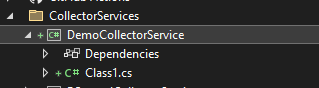

# FuelPriceWizard - DataCollector
This sub-project serves as the base project for data collection services. The actual services can be added via an appsettings.json entry and placement of the .dll file in the project folder.

## Create a new data collector service
You create a class library with an entry class, define specific appsettings and utilize DI (DependencyInjection).
For a complete demo configuration see the [Demo collector service configuration](#demo-collector-service-configuration) section further down.

### 1. Create a new ClassLibrary in this solution under the ``CollectorServices`` folder naming it ``<YourServiceName>CollectorService``
### 2. Add an ``appsettings.json`` file naming it ``appsettings.<ServiceClassName>.json``
In the appsettings file you have to define fetch settings as well as any service specific settings.
The **FetchSettings section is mandatory** and defined as follows:

```json
"FetchSettings": {
  "ExcludedWeekdays": [ "Saturday", "Sunday" ],
  "IntervalValue": 5,
  "IntervalUnit": "Second",
  "StartNextFullHour": false
}
```

| Name | Description | Possible Values |
| :- | :-:         | :-    |
| ExcludedWeekdays | Defines a list of weekdays where the service is not run or where the service is skipped | <ul><li>Monday</li><li>Tuesday</li><li>Wednesday</li><li>Thursday</li><li>Friday</li><li>Saturday</li><li>Sunday</li></ul> |
| IntervalValue | Defines the interval in which the periodic service is run | any number value |
| IntervalUnit | Defines the interval unit of the interval value (every x units) | <ul><li>Second (every x seconds)</li><li>Minute (every x minutes)</li><li>Hour (every x hours)</li></ul> |
| StartNextFullHour | Defines if the collection circle is run with the interval starting on the next full hour or immediatly with the start of the service<br>``(e.g. service is started at 12:43 but the first collection circle starts at 13:00)`` | <ul><li>true</li><li>false</li></ul> |

### 3. Create the entry-point class extending the [BaseFuelPriceSourceService&lt;T&gt;](../FuelPriceWizard.BusinessLogic/BaseFuelPriceSourceService.cs) class and implementing the [IFuelPriceSourceService](../FuelPriceWizard.BusinessLogic/IFuelPriceSourceService.cs) interface included in the ``FuelPriceWizard.BusinessLogic`` project

### 4. Adding the new service
To add the new service add a new entry in the appsettings.json file under the **ImplementationAssemblies** section:

```json
"ImplementationAssemblies": [
  {
    "Enabled": true,
    "FilePath": "MockUpFuelPriceSourceCollectorService.dll",
    "Type": "MockUpFuelPriceSourceCollectorService.MockUpFuelPriceService"
  }
  ...
]
```

- ***Enabled:*** Defines whether the implementation is enabled or disabled. Defaults to ```true``` when not specified.
- ***FilePath:*** Defines ***where the .dll file is located***, normally this is the active folder (working directory) and therefore the filename itsself is sufficient but if the file is located somewhere else you would have to specify the relative path here. (``e.g. ..\\..\\..\\..\\MockUpFuelPriceSourceCollectorService\\bin\\debug\\net8.0\\MockUpFuelPriceSourceCollectorService.dll`` => Specifies the .dll file in the build output directory of the MockUpFuelPriceSourceCollectorService project)
- ***Type:*** Defines the ***full name of the service class*** (including its namespace)

## Create unit tests for a collector service
To create unit tests for the collector service you will have to create a new xUnit project in the ``Tests`` folder and call it ``<YourServiceName>CollectorService.Tests``

It's as easy as that and the rest is done automatically.

## Demo collector service configuration
This section shows a full demo configuration of a new collector service (**DemoCollectorService**)

1. Create the ClassLibrary project under the ``CollectorServices`` folder and add a reference to the ``FuelPriceWizard.BusinessLogic`` project



2. Add a reference to the FuelPriceWizard.BusinessLogic project

3. Create and implement the entry-point class and extend [BaseFuelPriceSourceService&lt;T&gt;](../FuelPriceWizard.BusinessLogic/BaseFuelPriceSourceService.cs)  and [IFuelPriceSourceService](../FuelPriceWizard.BusinessLogic/IFuelPriceSourceService.cs)

```cs
using FuelPriceWizard.BusinessLogic;
using FuelPriceWizard.DataAccess;
using FuelPriceWizard.Domain.Models;
using Enums = FuelPriceWizard.BusinessLogic.Modules.Enums;
using Microsoft.Extensions.Configuration;

namespace DemoCollectorService
{
    public class DemoCollectorService : BaseFuelPriceSourceService<DemoCollectorService>, IFuelPriceSourceService
    {
        public DemoCollectorService(IConfiguration configuration, ILogger<DemoCollectorService> logger
            IFuelTypeRepository fuelTypeRepository, ICurrencyRepository currencyRepository)
            : base(configuration, logger, fuelTypeRepository, currencyRepository)
        {
        }

        public override Dictionary<string, Enums.FuelType> FuelTypeMapping => new()
        {
            { "DIE", Enums.FuelType.Diesel },
            { "SUP", Enums.FuelType.Super },
        };

        public override Enums.Currency Currency => Enums.Currency.EUR;

        public Task<IEnumerable<PriceReading>> FetchPricesByLocationAndFuelTypeAsync(decimal lat, decimal lon,
          Enums.FuelType fuelType, bool includeClosed = true)
        {
            //TODO: IMPLEMENT THE FETCH METHOD FOR LOCATION AND FUELTYPE
        }

        public Task<IEnumerable<PriceReading>> FetchPricesByLocationAsync(decimal lat, decimal lon, bool includeClosed = true)
        {
            //TODO: IMPLEMENT THE FETCH METHOD FOR LOCATION
        }
    }
}
```

4. Add the collector-specific appsettings.DemoCollectorService.json file including the FetchSettings section


```json
{
  "FetchSettings": {
    "AssemblyName": "DemoCollectorService",
    "ExcludedWeekdays": [ "Saturday", "Sunday" ],
    "IntervalValue": 1,
    "IntervalUnit": "Minute",
    "StartNextFullHour": false
  }
}
```

5. Add the appsetings.json assembly entry in the FuelPriceWizard.DataCollector project

```json
 "ImplementationAssemblies": [
   {
     "FilePath": "DemoCollectorService.dll",
     "Type": "DemoCollectorService.DemoCollectorService"
   }
```
